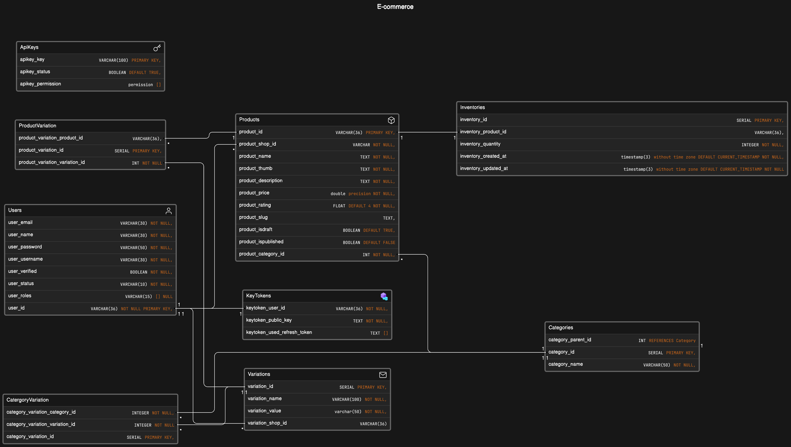

**## ✨ [NodeJS E-cormmerce for learning] ✨**

A robust and scalable Node.js application leveraging Express for a seamless API and PostgreSQL for powerful database management.

**️ Getting Started**

1. **Prerequisites:**

   - bun (1.1)
   - postgres (16.1)
   - docker

2. **Clone the Repository:**

   ```bash
   git clone https://github.com/phamvant/tipjs.git
   cd tipjs
   ```

3. **Install Dependencies:**

   ```bash
   bun install
   ```

4. **Environment Variables:**

   Create a file named `.env` in `src/app` directory (exclude it from version control using `.gitignore`). Define your database connection details and any other sensitive environment variables:

   ```
    DATABASE_URL_DEV
    DATABASE_HOST_DEV
    DATABASE_PORT_DEV
    DATABASE_NAME_DEV
    DATABASE_USERNAME_DEV
    DATABASE_PASSWORD_DEV
    SERVER_PORT_DEV

    DATABASE_URL_PRO
    DATABASE_HOST_PRO
    DATABASE_PORT_PRO
    DATABASE_NAME_PRO
    DATABASE_USERNAME_PRO
    DATABASE_PASSWORD_PRO
   ```

5. **Start the Development Server:**

   ```bash
   bun start:dev
   ```

**️ Project Structure**

```
.
├── README.md  (You're here!)
├── package.json  (Project dependencies)
├── .gitignore  (Files to exclude from version control)
├── src/app
│   ├── controllers/  (API endpoint logic)
│   ├── .env  (Environment variables - excluded from Git)
│   ├── models/  (Database models)
│   ├── middlewares/  (Request/response middleware)
│   ├── utils/  (Utility functions)
│   └── server.js  (Express server configuration)
├── tests/  (Unit and integration tests)
└── Dockerfile  (Optional: Docker configuration)
```

**️ API Documentation**

This project offers a RESTful API, providing clear documentation for each endpoint. You can leverage tools like Swagger or Postman for interactive exploration. Refer to the `controllers` directory for endpoint implementation details.

**️ Database Setup**

1. **Create a PostgreSQL Database:**

   Create a PostgreSQL database by run docker-compose file.

2. **Database Migrations:**
   Update schema by docker command
   ```
   docker exec "container" psql "user" -d "database" -h "host" -f "path"
   ```

## Database Design



**️ Security Considerations**

- **Environment Variables:** Never store sensitive information directly in code. Use `.env` or a secure configuration management service.
- **Input Validation:** Sanitize user input to prevent injection attacks (XSS, SQL injection).
- **Authentication and Authorization:** Implement robust authentication and authorization mechanisms to control access to different API endpoints and resources.
- **Regular Updates:** Maintain your dependencies and Node.js version to address security vulnerabilities promptly.

**️ Additional Note**

- Consider adding badges for CI/CD integration, code coverage, and license information.
- Enhance the README with screenshots, diagrams, or a GIF showcasing your application in action (optional).
